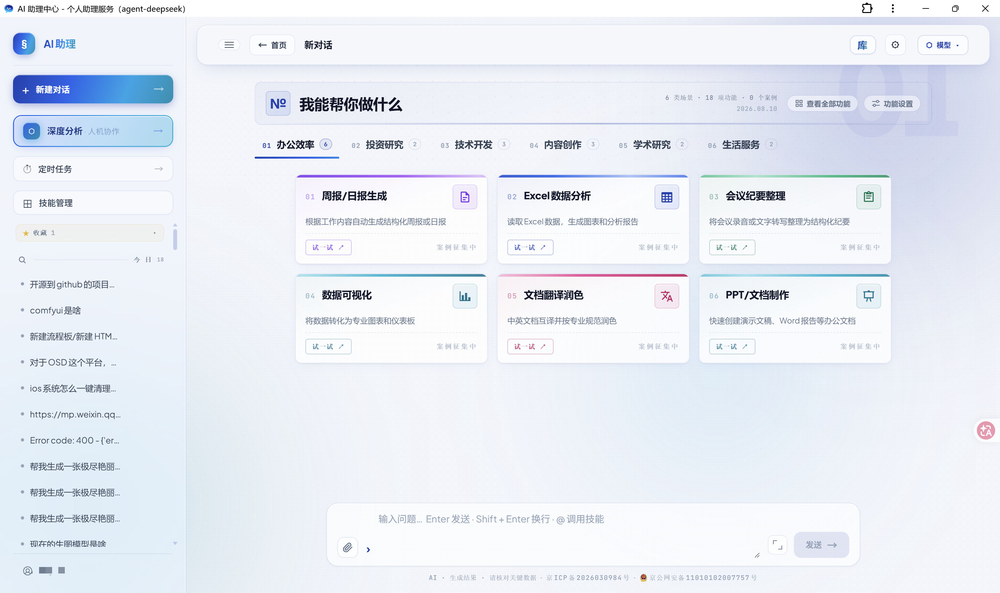
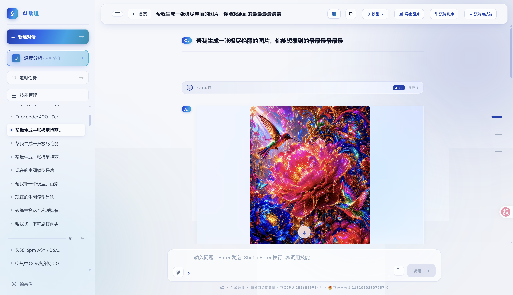
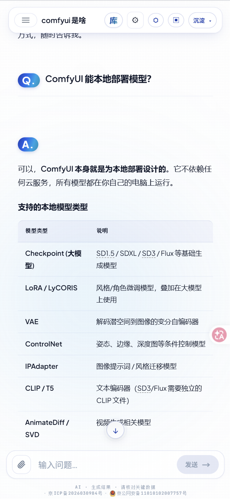
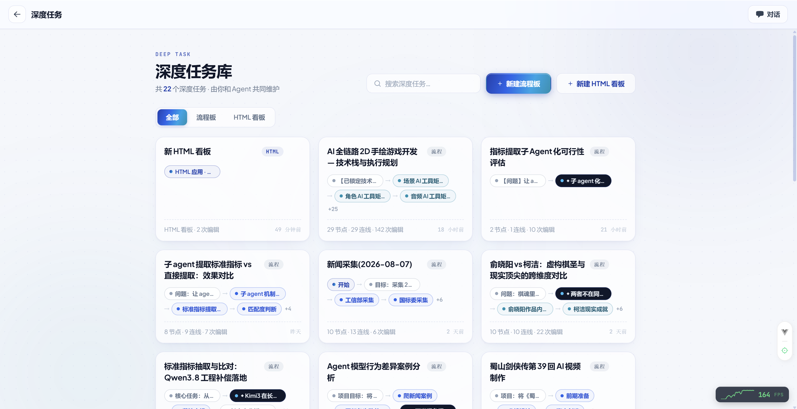
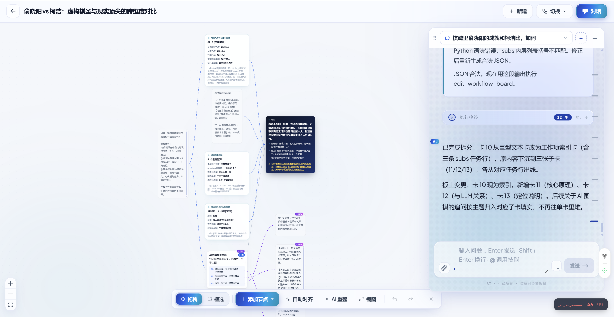
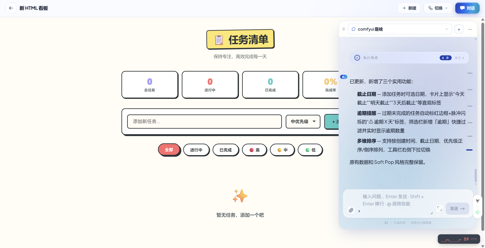
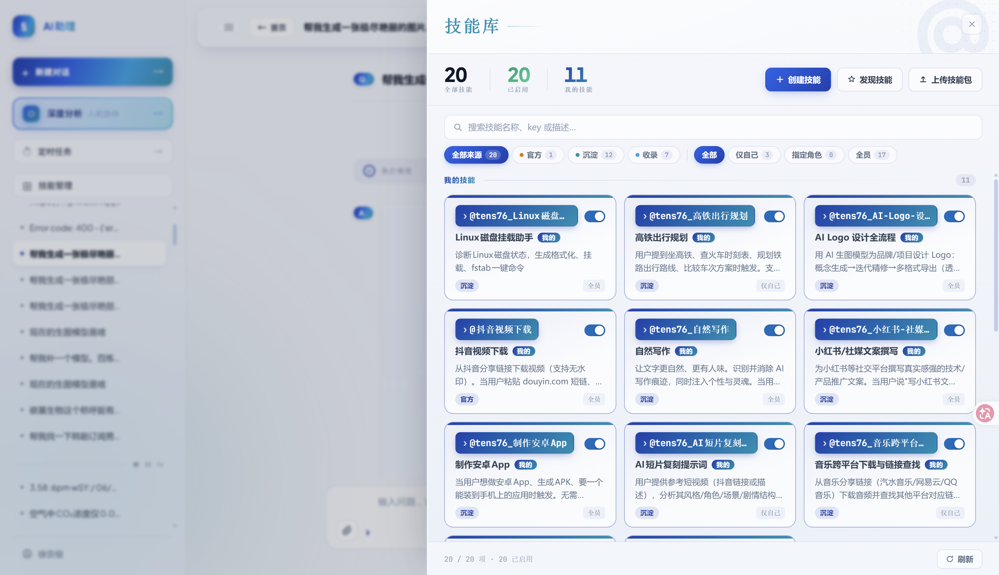
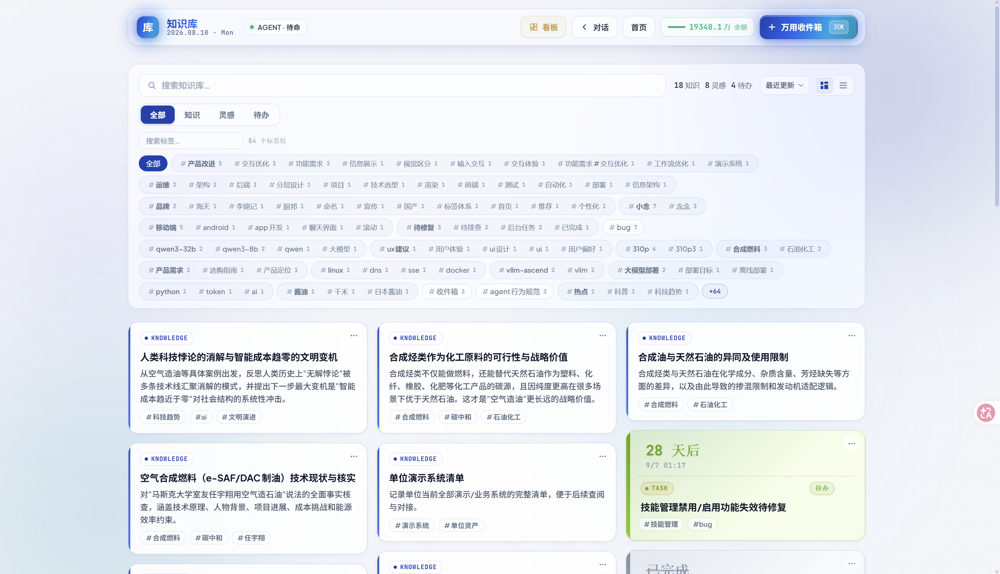

<!-- markdownlint-disable MD033 MD041 -->

<p align="center">
  
</p>

<div align="center">

# Agent DeepSeek

> 开源、可私有部署的全栈 Agent web 平台：以 DeepSeek 为基础模型，兼容任意 OpenAI 协议模型；多层子代理编排 × 技能凝练 × 深度分析，另有一堆丰富细节，完全兼容手机端；Docker 一键部署，前后端一体轻量化，是一个完美契合vide coding时代的项目。

[](./LICENSE)


🔗 **在线预览**：[agent-deepseek.com](https://agent-deepseek.com)

</div>

---

## 简介

**Agent DeepSeek** 是一个端到端、可私有部署的完整 Agent 平台。它基于 **LangChain / LangGraph / Deep Agents** 构建，把一个对话框背后串起了 **LLM 推理 / 多层 Agent 编排 / 虚拟文件系统 / Shell 执行 / 联网搜索 / 图像视频生成 / 持久记忆 / 可凝练技能体系 / AI 托管知识库**——你说一句话，它自己规划、自己调工具、自己写答案；你做完一段对话，可以一键把整段流程凝练成一位新的 "AI 助理"，下次 `@` 即可召唤。

整套系统基于 **FastAPI + Vue3** 全栈构建，以 **DeepSeek 为基础模型**，同时兼容任意 OpenAI 协议的大模型（DeepSeek 官方、DashScope、Ollama、vLLM、自建网关、OpenAI 官方均可），**纯 Web 部署、完全兼容手机端、Docker 一键拉起**。内置一键打包脚本，支持 **在线源码部署** 与 **离线内网部署** 两种交付形态；Windows 桌面单机版打包已在内测。

<!-- 截图占位：产品整体截图，建议 1440px 宽，放到 screenshots/overview.png -->
<p align="center">
  
</p>

## ✨ 核心亮点

### 1. 🤖 比肩一线国产 Agent 的完整平台

基于 LangChain 生态的 **Deep Agents** 实现的完整 Agent 平台，能力对齐 **WorkBuddy、扣子（Coze）、Dify、FastGPT、RagFlow** 等国产优秀 Agent 产品——而它们之中，要么闭源托管、要么偏工作流编排、要么只做 RAG 问答。本项目提供的是**一整套可私有部署、可二次开发的完整 Agent 底座**：

- **自主任务执行**：一句话扔进去，AI 自己拆解步骤、规划子任务、调用工具、整理产物
- **多层 Subagent 编排**：复杂任务自动分派给子 Agent 并行处理
- **虚拟文件系统 + 隔离 Shell**：AI 拥有自己的工作目录，读文件、写代码、跑脚本，全程沙箱隔离
- **MCP 协议接入**：联网搜索、第三方服务即插即用
- **流式全程可见**：每一步思考、工具调用、生成产物实时推送，可中途打断
- **持久会话记忆**：重启后凭 session 完整恢复历史对话与产物
- **纯 Web 部署**：Docker Compose 一键拉起，浏览器即用；Windows 桌面单机版（setup.exe）内测中
- **完全兼容手机端**：手机、平板浏览器打开即用，对话、知识库、技能管理全部适配，无需安装 App

<!-- 截图占位：对话页截图（展示流式输出/工具调用过程），放到 screenshots/chat.png -->
<p align="center">
  
</p>

<!-- 截图占位：手机端对话页截图（竖屏，宽建议 360px 左右展示），放到 screenshots/mobile.png -->
<p align="center">
  
</p>

### 2. 🔬 深度分析：不是黑盒报告，是人机深度协作

各平台都有 "深度分析 / Deep Research"，但几乎都是同一种形态：提问 → 漫长等待 → 一份无法干预的长报告，过程是黑盒，方向偏了只能推倒重来。

我们的深度分析核心是**人与 AI 的深度协作**——分析过程本身就是一块双方都能编辑的白板：

1. **你提出问题**：例如 "帮我深度对比这两套技术方案的优劣"
2. **AI 构建画板**：自动把问题拆解成一张可视化的工作流画板，任务卡片、执行顺序一目了然
3. **人机协作调整**：你可以直接在画板上增删卡片、调整顺序、修改任务描述、补充上下文——**即使在 AI 响应期间也能随时编辑**
4. **AI 按画板执行**：逐任务推进，每个卡片的中间结果实时回流画板，进展全程可见
5. **多轮迭代收敛**：不满意就继续调整画板，AI 接着干，直到得到你要的结果

画板跨会话持久保存、可复用——同类问题二次分析，直接套用上次的工作流。

<!-- 截图占位：深度分析画板截图（展示任务卡片与执行状态），放到 screenshots/deep-analysis-board.png -->
<p align="center">
  
</p>

<p align="center">
  
</p>

<p align="center">
  
</p>

### 3. 🧩 技能管理：零经验构建自己的 Skill

技能（Skill）是 Agent 的 "操作手册 + 工具脚本" 组合，遵循 [Anthropic Agent Skills 规范](https://agentskills.io)。围绕它我们做了一整套零门槛的生产与消费闭环：

- **零经验构建**：用一句话描述你想要的技能，AI 自动生成完整技能包（说明文档 + 脚本 + 依赖），无需懂任何规范细节
- **可视化编辑**：写一段 prompt 也能定义新助理，即改即生效
- **全网发现、自主安装**：让 AI 帮你从外部网络搜索、评估并一键安装社区技能
- **上传与原地升级**：zip 拖拽上传，已有技能可原地升级、保留数据
- **一键凝练**：每跑通一次任务，可一键凝练成新的 AI 助理 / 技能——下次 `@` 一下就能召唤，一次教会、永久可用
- **业务经验资产化**：经验从 "老同事脑子里" 变成 "团队随时调取的资产"

<!-- 截图占位：技能管理/上传页截图，放到 screenshots/skill-manage.png -->
<p align="center">
  
</p>

### 4. 🧠 知识库管理：由 AI 组织，而非笨蛋堆叠

传统笔记 / 知识库工具的通病：收藏一时爽，堆成山后再也不翻。本项目的个人知识库**全部由 AI 组织管理**：

- **多种内容形式**：不止知识碎片——灵感、待办、经验总结、结论沉淀，统统收纳
- **双入口沉淀**：对话消息上一键「📌 记住」；或在对话中自然说出 "记住这个"，AI 自动识别沉淀意图，无需打断当前工作
- **AI 全权整理**：每条新内容入库前，AI 先做语义检索，自主决定——重复则只记来源、相关则合并进已有篇章、新主题则开新篇并自动归类。**永远不产生零散碎片的无脑堆叠**
- **对话即资产**：对话内容不再阅后即焚，有价值的部分被 AI 组织进知识库，成为可二次翻阅的积累
- **双向服务**：人把它当笔记随时翻阅检索；AI 把它当长期记忆，在后续对话中自动检索复用——知识库真正 "越用越聪明"

<!-- 截图占位：知识库工作台截图，放到 screenshots/knowledge-base.png -->
<p align="center">
  
</p>

### 5. 🧬 AI 时代的代码库：一体性设计，AI 上手即改

这个项目本身就是「人机协作开发」的产物，也是为 AI 编程时代设计的代码库：

- **仓库自带 `CLAUDE.md` 工程手册**——不是写给人看的泛泛介绍，而是写给 AI coding agent 的完整上下文：架构分层、接口契约、错误码红线、缓存陷阱、部署注意事项，全部成文。用 Claude Code 打开项目，AI 立刻拥有专家级项目认知
- **全栈高度一体的约定**：响应码契约、模型配置块、工具注册、SSE 流式协议、前端请求层，处处同一套范式——AI 看懂一处即可举一反三改遍全局，几乎不存在"每个模块各写各的"的理解成本
- **一句话完成全栈修改**：描述需求，Claude Code / Codex 等工具可以直接完成「后端接口 + 前端页面 + 配置 + 权限数据」的整条链路修改
- 项目的绝大多数功能正是这样完成的：人提需求、把关验收，AI 负责实现——这套工作流本身也沉淀在 `CLAUDE.md` 里，可以直接复用

### 6. 🚀 更多能力

| 能力 | 说明 |
|------|------|
| **多模型热切换** | 内置 Qwen / Grok / Claude / Kimi 等对话模型 + GPT-image / Qwen-Image 图像生成 + Seedance / Grok Imagine 视频生成，超管页面一键全局切换，无需重启、凭据绝不出服务端 |
| **多模态理解** | 图片直接拖进对话，支持视觉的模型多模态直传，纯文本模型自动走视觉兜底 |
| **图像 / 视频生成** | 对话中直接生成图片、图生视频，产物以卡片形式在对话流中预览 |
| **文件协作** | 拖拽上传任意文件（10 GB 也行）：Word / Excel / PDF / 压缩包 / 代码 / 图像，看得懂、改得了、产得出可下载文件 |
| **浏览器自动化** | 内置 browser-use 技能，AI 可自主打开网页、点击、截图、抓取 |
| **联网搜索** | MCP 协议接入外部搜索（DashScope WebSearch 等） |
| **批次任务** | 一条指令对多条数据并发执行，前台实时看进度 |
| **图表渲染** | 内嵌柱图 / 折线 / 饼图 / 散点，AI 直接输出 chart JSON |
| **运行追踪** | 每一步工具调用、思考过程、产物登记全程留痕，可追溯、可审计 |
| **企业级底座** | 完整 RBAC 权限体系、JWT 双 Token 鉴权、操作审计、数据库驱动菜单——既能做 AI 平台，也能直接当中后台脚手架 |
| **极简部署** | 两条命令完成打包上线，源码即交付物；另支持离线全量包 / 仅代码更新包 |

<!-- 截图占位（可选）：模型切换面板截图，放到 screenshots/model-switcher.png -->

## 🏗️ 技术架构

### 后端（`/app`）

```
Router → Controller → CRUD / Model
                ↓
        Agent Runtime
           ├── Deep Agents（多层 subagent 编排）
           ├── LangGraph（状态持久化 / checkpointer）
           ├── FilesystemMiddleware（虚拟文件系统）
           ├── SkillsMiddleware（按需加载技能文档）
           ├── LocalShellBackend（隔离的命令执行）
           └── MCP 客户端（外部工具接入）
```

- **FastAPI** + **Tortoise ORM**：异步优先，单 worker 事件循环严格无阻塞
- **SSE 流式协议**：实时推送 token、工具调用、推理痕迹
- **JWT 鉴权**：access token（12h）+ refresh token（7d）双 Token 机制，前端静默刷新
- **API 自注册**：启动时把路由元信息写入 DB，权限系统即插即用
- **模型配置两层架构**：角色块（对话/视觉/Embedding）+ 能力块（图像/视频），激活块重定向机制实现消费方零改动的全局热切换

### 前端（`/web`）

- **Vue 3** + **Vite 7** + **TypeScript** + **Naive UI** + **Pinia**
- **Elegant Router**：基于文件结构自动生成路由，菜单由数据库驱动
- **pnpm monorepo**：HTTP / hooks / utils 等内部包独立维护
- **SSE 流式渲染**：边收 token 边渲染 Markdown / 工具调用 / 思考过程
- **工作流画板**：可视化拖拽编辑，AI 响应期间不锁死编辑权

### Skill 体系

每个技能独立、可移植、可跨项目复用，结构遵循 Anthropic Agent Skills 规范：

```
.agent_skills/<skill-name>/
├── SKILL.md           # YAML frontmatter（name + description）+ 操作说明
├── scripts/           # 可执行脚本
├── references/        # 按需加载的详细文档
└── assets/            # 模板/资源文件
```

## 🚀 快速开始

### 方式一：Docker 部署（快速体验）

```bash
git clone <repo>
cd <project>

# 配置环境变量
cp .env.example .env       # 填 LLM API Key 等
cp web/.env.example web/.env

# 启动（Nginx :1880 + FastAPI :9999 + Redis）
docker compose up -d --build

# 查看日志
docker compose logs -f app
```

访问 `http://localhost:1880`。

### 方式二：本地开发

环境要求：

| 工具 | 版本 |
|------|------|
| Python | ≥ 3.12 |
| Node.js | ≥ 20.19 |
| pnpm | ≥ 10.5 |
| MySQL / OceanBase | 任意（业务数据库） |
| Redis | 任意（缓存可选） |

```bash
# 后端依赖
pdm install

# 前端依赖
cd web && pnpm install && cd ..

# 启动后端（端口 9999）
python run.py

# 新开终端，启动前端（端口 9527）
cd web && pnpm dev
```

### 关键环境变量

```bash
# 主对话 LLM（OpenAI 兼容协议；默认块为 CHAT_DASHSCOPE，可再配多个预设块供超管切换）
CHAT_DASHSCOPE_BASE_URL=https://dashscope.aliyuncs.com/compatible-mode/v1
CHAT_DASHSCOPE_API_KEY=sk-xxxx
CHAT_DASHSCOPE_MODEL=qwen-plus
CHAT_DASHSCOPE_VISION_SUPPORTED=true

# 可选：视觉理解 / Embedding
VISION_BASE_URL=... / VISION_API_KEY=... / VISION_MODEL=...
EMBED_BASE_URL=... / EMBED_API_KEY=... / EMBED_MODEL=...

# 可选：图像 / 视频生成
IMAGE_PROVIDER=apipod / IMAGE_API_KEY=... / IMAGE_MODEL=...
VIDEO_PROVIDER=ark    / VIDEO_API_KEY=... / VIDEO_MODEL=...

# 可选：联网搜索（DashScope MCP）
DASHSCOPE_API_KEY=...

# 业务数据库
STANDARD_MYSQL_HOST=... / STANDARD_MYSQL_PORT=... / STANDARD_MYSQL_USER=...
STANDARD_MYSQL_PASSWORD=... / STANDARD_MYSQL_DB=...

# JWT
SECRET_KEY=<生成一段随机串>
```

完整配置见 `.env.example`。

## 📦 部署与打包

**极简部署**是本项目的一大特色：不依赖 CI、不依赖镜像仓库，**源码即交付物**——日常更新全链路只有两条命令：本地 `python pack_deploy.py` 一键打包，服务器 `bash restart_cesi-fast-admin.sh` 一键解压并拉起，从改完代码到线上生效一气呵成。

正式交付走内置的一键打包脚本，覆盖从在线服务器到离线内网的部署场景：

| 脚本 | 产物 | 适用场景 |
|------|------|------|
| `pack_deploy.py` | `deploy_package_<时间戳>.zip` | 在线源码部署：整包源码上传服务器，Docker 构建启动 |
| `pack_deploy_offline.py` | `offline_package_*.zip` / `update_package_*.zip` | 离线内网部署：镜像 + 前端全量包，以及仅代码的日常更新包 |
| `pack_desktop.py` 🚧 | `setup.exe` + 绿色免安装目录 | Windows 桌面单机版（内测中） |

### 在线源码部署

```bash
python pack_deploy.py
# 交互式选择品牌变体（standard 内网 1880 / generic 外网 80+443）
# 本地预构建前端（web/dist 随包分发，服务器零 node 编译）→ 产出 deploy_package_<时间戳>.zip
```

上传至服务器后：

```bash
bash restart_cesi-fast-admin.sh   # 一键解压（保留服务器 .env.prod）+ 自动选择最快部署路径
```

- 脚本自动检测依赖变更：`pdm.lock` / `pyproject.toml` 未变 → **跳过镜像重建，仅重启 app**；有变更或首次部署 → 自动 `--build`
- 前端产物由 nginx 直接挂载：**前端更新无需重建、无需重启**
- 依赖在构建期烘焙进镜像、源码运行时挂载；手动强制重建：`docker compose up -d --build`

### 离线内网部署（目标机器无网络）

```bash
python pack_deploy_offline.py
# 完整打包（首次部署）：构建 app 镜像 → docker save 导出 tar → 构建前端
#   → offline_package_<时间戳>.zip（含全部镜像与 deploy_offline.sh）
# 仅打包代码（日常更新）：→ update_package_<时间戳>.zip + update.sh
```

目标机器上：

```bash
# 首次部署
unzip -O UTF-8 offline_package_*.zip && cd cesi-fast-admin && bash deploy_offline.sh

# 日常更新
bash update.sh update_package_<时间戳>.zip   # 覆盖代码 + restart app，前端自动生效
```

### Windows 桌面单机版（内测中）

```bash
python pack_desktop.py   # 产出可双击安装的 setup.exe（Inno Setup）+ 绿色免安装目录
```

嵌入式 Python + 便携 Redis 全部打进安装包，数据库与大模型可保持远程，终端用户装完即用。

## 📁 项目结构

```
.
├── CLAUDE.md                  # AI coding agent 工程手册（项目约定 / 红线 / 陷阱）
├── app/                       # 后端
│   ├── api/v1/                # FastAPI 路由（auth / system-manage / ai/…）
│   ├── controllers/           # 业务逻辑层
│   ├── models/                # ORM 模型（系统表 + 业务表）
│   ├── schemas/               # Pydantic schema（camelCase 出参）
│   ├── core/                  # 应用工厂、鉴权依赖、中间件、CRUD 基类
│   ├── langchain/             # AI 子系统：Agent / Tool / 模型配置 / MCP
│   └── services/              # Agent 运行时、知识库、外部生成 API client
├── web/                       # 前端 monorepo
│   ├── src/views/ai/          # 对话工作台 / 知识库 / 深度分析画板 / 技能管理
│   ├── src/views/system/      # 用户 / 角色 / 菜单 / API 管理
│   └── packages/              # 内部工具包
├── .agent_workspace/          # Agent 隔离工作目录（运行时生成）
│   └── .agent_skills/         # 技能包目录，每个技能独立可分发
├── deploy/                    # Docker / Nginx 配置
├── pack_deploy.py             # 在线源码部署一键打包
├── pack_deploy_offline.py     # 离线内网部署一键打包（全量 / 增量）
├── pack_desktop.py            # Windows 桌面单机版打包（内测中）
├── tests/
└── docker-compose.yml
```

## 🗺️ 路线图

- [x] Deep Agents 多层 subagent 编排
- [x] 深度分析工作流画板（人机协作编辑）
- [x] 技能体系：内置 / 凝练 / 自建 / 全网发现 / 上传升级
- [x] AI 托管个人知识库（碎片 / 灵感 / 待办）
- [x] 图像 / 视频生成、浏览器自动化、联网搜索
- [x] 超管多模型全局热切换
- [ ] **桌面客户端**（Windows 单机版打包链路 `pack_desktop.py` 已内测，正式版规划中）
- [ ] 技能市场（在线分享、一键安装）
- [ ] 更多内置技能（演示文稿、音频生成等）

## 🤝 参与贡献

欢迎提交 Pull Request 或 Issue。Bug 修复、新技能、新工具、文档完善都非常欢迎。

## 🙏 致谢

本项目站在以下优秀开源项目的肩膀上：

- [FastAPI](https://fastapi.tiangolo.com/) / [Pydantic](https://docs.pydantic.dev/)
- [LangChain](https://github.com/langchain-ai/langchain) / [LangGraph](https://github.com/langchain-ai/langgraph) / [Deep Agents](https://github.com/langchain-ai/deepagents)
- [Anthropic Agent Skills](https://agentskills.io)
- [SoybeanAdmin](https://github.com/soybeanjs/soybean-admin)
- [Tortoise ORM](https://tortoise.github.io)
- [Naive UI](https://www.naiveui.com/)

## 📄 开源协议

[MIT License](./LICENSE) © 2026

可自由使用与修改，商业使用请保留作者版权信息。
